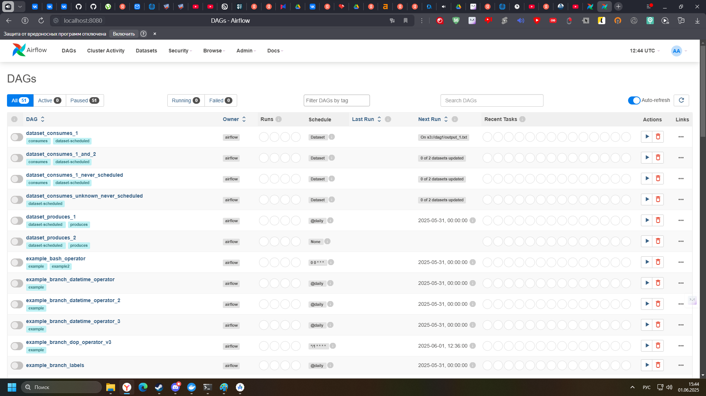

Лаба оказалась весьма простой, так что особо без подробностей. 
1)Удаляем лишние строки согласно инструкции в докер компоузе.
Готовый файл:[docker-compose.yaml](docker-compose.yaml)

2) Пишем в "docker compose up -d" cmd. Я не запаривался и оставил компост файл прямо в загрузках. Папки создались там же.

3) Ждем. Докер все сделает сам. В конце в десктоп клиенте проверяем что все едет:

4) Заходим в airflow и проверяем работу:

Дополнительные вопросы:
1)Для чего нужен docker-compose? Своими словами, без
определений из интернета?
Ответ: Если своими словами, то функционал очень похож на pip в python (особенно при установке используя requirements.txt). Прото при помощи файлика с зависимостями
каждый человек сможет получить рабочее контейнерное решение с кучей сервисов без особой настройки. 
+позволяет не раздавать с своего сервера несколько гиговый пакет образа, а просто мелкий файл с настройкой для докера.

2)Как в docker-compose сделать ограничения для контейнера по
ресурсам (CPU, RAM)?
Ответ:
Настраивается в компос файле:

    version: '3.7'
    services:
      my-service:
        deploy:
          resources:
            limits:
              cpus: '2'
              memory: '256M'
            reservations:
              cpus: '1'
              memory: '128M'