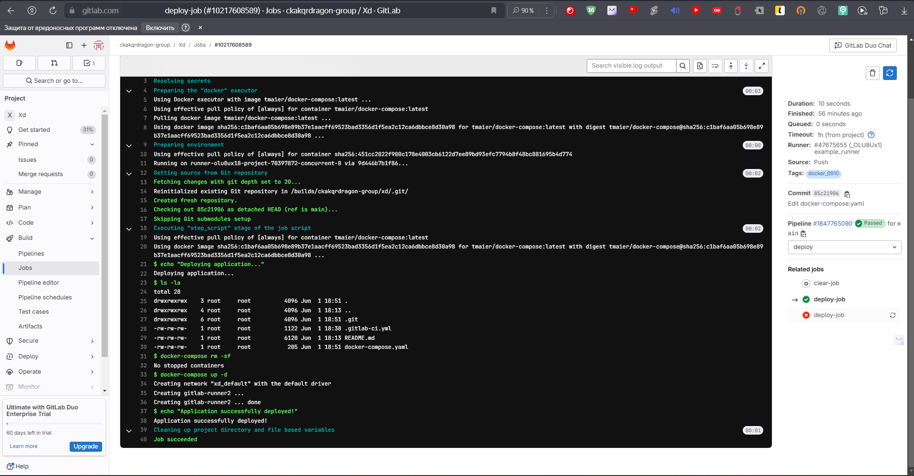
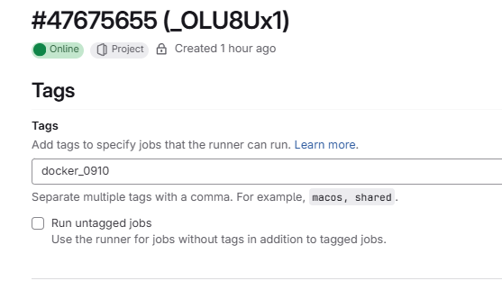
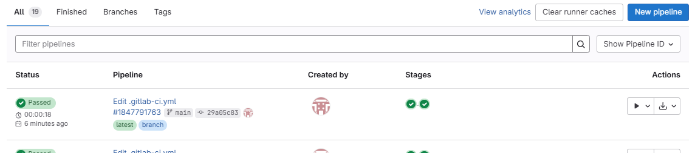

Начинаем ЛР2 с инструкции по подьему гитлаба.
В конце действий получаем рабочий пайплайн:

Приступаем к индивидуальному заданию:
Добавляем ветку тест и правило, что деплой выполняется только для веток мейн и девелоп. Финальный файл:

[gitlab-ci.yml](gitlab-ci.yml)

Добавляем правило чтобы раннер мог работать только с нашими тегированными джобами:

Проверяем финальную сборку:

Успех!

Файл из первой лабы: [docker-compose.yaml](docker-compose.yaml)
Файл из второй лабы: [gitlab-ci.yml](gitlab-ci.yml)